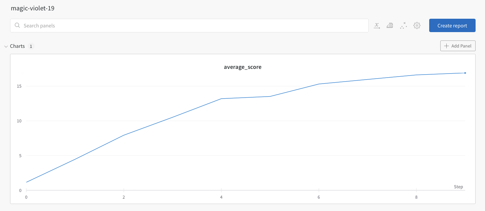
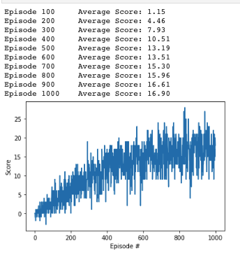
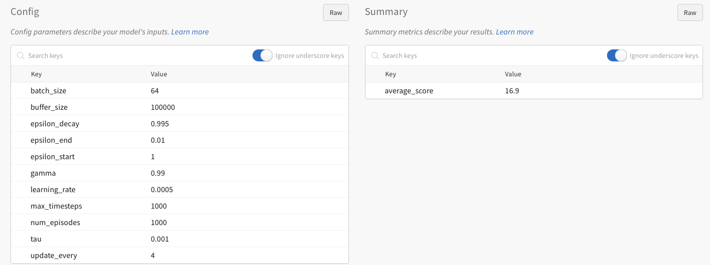

## Sections
1. Learning algorithm and network design
2. Hyperparameter explanations 
3. Goal 
4. Future work

## 1. Learning algorithm and network design
I chose a DQN - a deep Q network. A deep Q network is an optimal policy learning method utilizing a deep neural net. The network is essentially a policy estimator function mapping input states to actions. 

My network design is comprised of fully connected network with ReLu between each layer. I experimented with changing layer sizes and adding an additional layer, but there was no discernable improvement on the performance (evaluated as average_reward over 100 episodes). 
The input space is the observed environment, it has 37 dimensions. There is no documentation on the input environment, but they appear to be ray traces from the nearest objects along with information about the two object color category (yellow or blue). 
The output space is the the possible actions. There are 4 actions that can be taken: 
- move forward 
- move backwards 
- move left 
- move right 

### Sequence of events 
Initialize the network randomly. 
For each episode 
1. Set score to zero
2. Choose an action 
3. Increment the environment based on that action
4. Add any reward to the episode score (-1, 0, or 1)
5. Save the experience and retrain the network every few time-steps. (state, action, reward, next_state, is_episode_done) 
6. Break if we have reached the limit of our timesteps allowed in the episode, or if the environment says we are done

## 2. Hyperparameters explanations 

Final choices for hyperparameters: 
- Replay buffer size: 10000 
- Batch Size:         64 
- Gamma:              0.99
- Learning Rate:      0.0005 
- Update_every:       4
- Epsilon_start:      1.0
- Epsilon_end:        0.01
- Epsilon_decay:      0.95

### Learning rate
Step size that gradient descent uses. Too small and you take too long, too large and you overshoot and aren’t precise enough

### Batch size
Size of bundle of experiences to learn from passed to the GPU. Limited by GPU RAM. 

### Replay buffer size
How many action-steps to store before we learn

### Update frequency
Determines how often to train the network, units are episodes

### Gamma
Rate at which old rewards are discounted, esentially the rate at which the model forgets past experiences

### Tau: 
At a very basic level, we have to ask ourselves, how do we know we are moving towards our goal? Our goal is maximizing reward. Our goal is twofold in the case of the banana gathering challenge: (1) avoid blue bananas and (2) get yellow bananas. Each sub-goal has an associated reward, and we want to maximize overall reward. A deep Q network is learning the best action to take based on what it sees in front of it. Its inputs are the environment it can “see”, and its outputs are the action probabilities, with the highest being the decision chosen. When we start off, we randomly initialize the model’s weights and biases, then we have the agent take a few actions. After a few actions, we learn from the experiences and and update the model. This is where the Tau hyperparameter comes in. We update the models using a “soft update”(see paper https://arxiv.org/pdf/2008.10861.pdf). This is done by actually using two models. One model is our “main” model, which we learn from, and the other is the “target” model. Every time before we train on new experiences, we make a copy of existing model. We then train the “target” network on the new data. After training, we extrapolate between the weights and biases from the “target” network and the “main” network, but there is a tradeoff. Too much target updating and the model’s predictions become noisy ( and don’t settle towards the ideal case as fast), too little updating and we learn too slowly. 

### Epsilon value 
The epsilon value determines the balance between exploring a new action, and staying with an existing action. This can also be framed from the perspective of the agent: Should I try for a new opportunity(explore) or should I stay with the current policy (exploit). It's always a tradeoff. Too much exploitation and the model never improves, too much exploration is resource intensive. 

## Goal and results 
The environment is considered to be solved when over a period of a hundred episodes the agent averages a reward of 13 or more. 
The below graph shows the results of the final model training. X axis is step values in hundreds of episodes. Y axis is average score per 100 episodes. 

<b> The model reached an average score of 13 after traing for 400 episodes on the hyper-parameters chosen above  </b>

## 3. Future work
Future work would mean a few improvements. First steps would be to 
* Create a double DQN. Double DQNs are better at estimating the value of an action. This would mean creating two networks, one which has learned from the most recent experience replay, and one which decides what to do next based on the Q-value. This prevents bias that would be created normally from learning on the last set of experiences and choosing actions that favor on that learning a bit too much. 

### Contributions
* The majority of the code came from this Unity project: https://github.com/udacity/Value-based-methods. 
